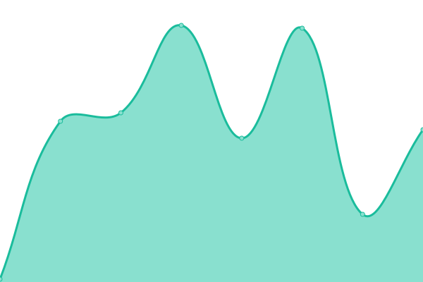
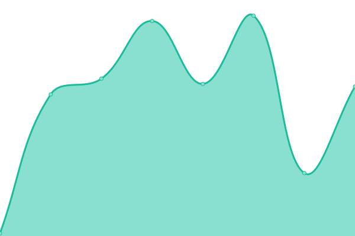

# [📈 Live Status](https://ittikorns.github.io/automate-status): <!--live status--> **🟩 All systems operational**

This repository contains the open-source uptime monitor and status page for [Mike](https://ittikorns.github.io/automate-status), powered by [Upptime](https://github.com/upptime/upptime).

With [Upptime](https://upptime.js.org), you can get your own unlimited and free uptime monitor and status page, powered entirely by a GitHub repository. We use [Issues](https://github.com/ittikorns/automate-status/issues) as incident reports, [Actions](https://github.com/ittikorns/automate-status/actions) as uptime monitors, and [Pages](https://ittikorns.github.io/automate-status) for the status page.

<!--start: status pages-->
<!-- This summary is generated by Upptime (https://github.com/upptime/upptime) -->
<!-- Do not edit this manually, your changes will be overwritten -->
<!-- prettier-ignore -->
| URL | Status | History | Response Time | Uptime |
| --- | ------ | ------- | ------------- | ------ |
|  [Automate Backend](https://keeper.dev.staking.ankr.com/v1/health) | 🟩 Up | [automate-backend.yml](https://github.com/ittikorns/automate-status/commits/HEAD/history/automate-backend.yml) | 

 463ms
     
 | 

<a href="https://ittikorns.github.io/automate-status/history/automate-backend">0.00%</a>
    

|  [BNB Testnet Node #1](https://keepernode-1.dev.staking.ankr.com/health) | 🟩 Up | [bnb-testnet-node-1.yml](https://github.com/ittikorns/automate-status/commits/HEAD/history/bnb-testnet-node-1.yml) | 

 322ms
     
 | 

<a href="https://ittikorns.github.io/automate-status/history/bnb-testnet-node-1">0.00%</a>
    

|  [BNB Testnet Node #2](https://keepernode-2.dev.staking.ankr.com/health) | 🟩 Up | [bnb-testnet-node-2.yml](https://github.com/ittikorns/automate-status/commits/HEAD/history/bnb-testnet-node-2.yml) | 

 337ms
     
 | 

<a href="https://ittikorns.github.io/automate-status/history/bnb-testnet-node-2">0.00%</a>
    

|  [Polygon Mumbai Node #1](https://keepernode-1.dev.staking.ankr.com/health) | 🟩 Up | [polygon-mumbai-node-1.yml](https://github.com/ittikorns/automate-status/commits/HEAD/history/polygon-mumbai-node-1.yml) | 

 96ms
     
 | 

<a href="https://ittikorns.github.io/automate-status/history/polygon-mumbai-node-1">0.00%</a>
    

|  [Polygon Mumbai Node #2](https://keepernode-2.dev.staking.ankr.com/health) | 🟩 Up | [polygon-mumbai-node-2.yml](https://github.com/ittikorns/automate-status/commits/HEAD/history/polygon-mumbai-node-2.yml) | 

 97ms
     
 | 

<a href="https://ittikorns.github.io/automate-status/history/polygon-mumbai-node-2">0.00%</a>
    

|  [BNB Mainnnet Node #1](https://keepernode-1.prod.automate.ankr.com/health) | 🟩 Up | [bnb-mainnnet-node-1.yml](https://github.com/ittikorns/automate-status/commits/HEAD/history/bnb-mainnnet-node-1.yml) | 

 248ms
     
 | 

<a href="https://ittikorns.github.io/automate-status/history/bnb-mainnnet-node-1">0.00%</a>
    

|  [BNB Mainnnet Node #2](https://keepernode-2.prod.automate.ankr.com/health) | 🟩 Up | [bnb-mainnnet-node-2.yml](https://github.com/ittikorns/automate-status/commits/HEAD/history/bnb-mainnnet-node-2.yml) | 

 238ms
     
 | 

<a href="https://ittikorns.github.io/automate-status/history/bnb-mainnnet-node-2">0.00%</a>
    

|  [Polygon Mainnnet Node #1](https://keepernode-1.prod.automate.ankr.com/health) | 🟩 Up | [polygon-mainnnet-node-1.yml](https://github.com/ittikorns/automate-status/commits/HEAD/history/polygon-mainnnet-node-1.yml) | 

 45ms
     
 | 

<a href="https://ittikorns.github.io/automate-status/history/polygon-mainnnet-node-1">100.00%</a>
    

|  [Polygon Mainnnet Node #2](https://keepernode-2.prod.automate.ankr.com/health) | 🟩 Up | [polygon-mainnnet-node-2.yml](https://github.com/ittikorns/automate-status/commits/HEAD/history/polygon-mainnnet-node-2.yml) | 

 46ms
     
 | 

<a href="https://ittikorns.github.io/automate-status/history/polygon-mainnnet-node-2">100.00%</a>
    

<!--end: status pages-->

[**Visit our status website →**](https://ittikorns.github.io/automate-status)

## 📄 License

- Powered by: [Upptime](https://github.com/upptime/upptime)
- Code: [MIT](./LICENSE) © [Mike](https://ittikorns.github.io/automate-status)
- Data in the `./history` directory: [Open Database License](https://opendatacommons.org/licenses/odbl/1-0/)
